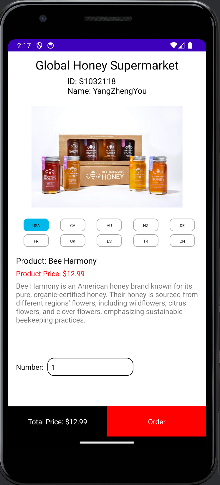

# Honey Brand App

## Overview

This project is an Android application that showcases different honey brands. It is developed in Kotlin and includes several core components that manage the display, selection, and details of honey brands.

## Features

- **Brand Display**: The app displays a list of honey brands, each including the brand name, country of origin, description, price, and an image.
- **Custom Grid Layout**: The application uses a custom `RecyclerView` layout with adjustable spacing between grid items.
- **JSON Parsing**: Honey brand data is stored in a JSON file, which is parsed using the Gson library.

## Code Overview

### 1. `BeeBrand.kt`
Defines the data models for the app:
- **`Brand`**: Represents each honey brand with details like `Brand`, `Country`, `Description`, `Price`, and `ImageURL`.
- **`BeeBrands`**: A collection of `Brand` objects.

### 2. `GridSpacingItemDecoration.kt`
Provides custom spacing between items in a grid layout, ensuring that the items are evenly spaced, with options to include or exclude edge spacing.

### 3. `GsonUtil.kt`
Contains utility functions to parse the honey brand JSON data (`brand.json`) into a `BeeBrands` object using the Gson library.

### 4. `HoneyActivity.kt`
This is the main activity that handles UI initialization and management:
- Sets up the `RecyclerView`.
- Configures the `HoneyAdapter`.
- Manages user interactions such as item selection and price calculation.

### 5. `HoneyAdapter.kt`
The `RecyclerView` adapter that handles displaying each honey brand in the list. It supports item selection and dynamically updates the UI to reflect the selected brand.
## Product Demonstration

## Video Demonstration
A video [honey](https://youtu.be/aGwHr68j2js?si=uJvGXp9L6w7TcABe) is included that provides a visual overview of the application's functionality and user interface.

## How to Run

1. **Clone the Repository**: Download the project files.
2. **Import into Android Studio**: Open the project in Android Studio.
3. **Build and Run**: Connect an Android device or use an emulator to run the application.

## Dependencies

- **Gson**: For parsing JSON data.
- **AndroidX**: For core Android components like RecyclerView.

---

This draft README document should provide a clear overview of the project, its features, and instructions on how to run it. If there are specific details or additional content you'd like to include, please let me know!
